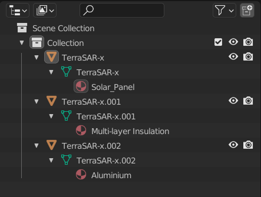

# Preparing the Target Mesh

The target is represented in Mitsuba by a collection of triangulated mesh files in Polygon File Format (.ply). Each file represents a component of a target spacecraft.

Each mesh is assigned a single material. To prepare the geometry for the simulation any CAD or mesh must be exported in .ply format with each file corresponding to a component or collection of components made of a single material. The process to achieve this will depend on the chose software and it may be necessary to export to another format (such as STL) before converting to PLY. The material assignment is done via the simulation software (currently) so there is no need to define them previously except to split the mesh if required.

---

## Splitting a CAD model
A simple low poly representation of TerraSAR-X was build using the opensource CAD software FreeCAD.

FreeCAD does not allow multiple bodies to be exported seperately (Some programs like SolidWorks offer this feature). To use seperate meshes for each component they will need to be exported individually or split once exported. Most CAD programs support OBJ export which can be easily read and split with many mesh manipulation tools such as blender.

Exporting from FreeCAD or a similar software as an OBJ file allows the mesh to be stored as a single file containing data on each object. This can then be imported to the open source 3D modelling software Blender.

This is also useful to double check mesh quality and scales as many CAD programs uses mm as default for exporting (including FreeCAD). Blender supports OBJ files, meaning each body will be recognised individually. From there all parts can be exported as seperate PLY files in one command using the Super Batch Export addon. Each file must be fully triangulated and in binary format. 

---

## Splitting a single Mesh
If the model used for the target comes as a single mesh without any differentiation between components then it must be split by hand. Blender is also an excellent tool to achieve this. The TerraSAR-X model was exported as a single mesh file and imported to blender. In the mesh editor the user can specify faces and assign materials to them through the GUI.

The materials are named and coloured for organisation only, the name and material properties are not carried to mitsuba.

Once the materials are assigned the mesh can be "seperated by material".

This provides seperate meshes based on each material which can be batch exported as before.

It is a good idea to name the bodies to identify them later in the process. Make sure all parts are kept in the same directory for ease of access.

---

## Final geometry summary checklist

- [x] Meshes should be in PLY format.
- [x] Fully triangulated mesh (an error will flag if this is not the case).
- [x] Double check face normals: If normals are incorrect certain parts of the mesh may appear completely black in the render. All database materials are double sided to prevent this issue.
- [x] Check scales: Mesh coordinates should correspond to meters (mesh point at 1,1,1 = 1m,1m,1m).
- [x] Check Origin of components: All components should have the same origin to ensure rotations are about the same point.